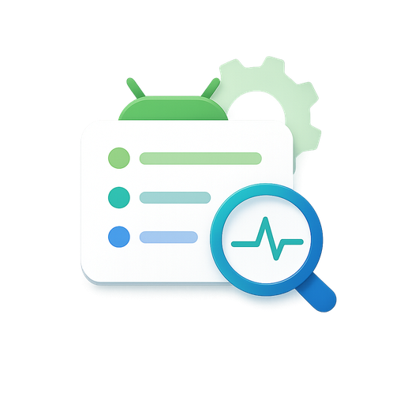

<p align="center">
  
</p>

<h1 align="center">ShizuLog</h1>

<p align="center">
  基于 Shizuku 的 Android 指定应用 Logcat 记录工具
</p>

<p align="center">
  <b>v1.1.0</b><br>
  作者 / 贡献者：<b>ChatGPT</b>
</p>

---

## 简介

ShizuLog 是一个使用 **Shizuku** 授权的 Android 日志记录与崩溃排查工具，
支持针对指定应用持续采集 Logcat、恢复日志会话以及补抓崩溃现场。

- **版本：** v1.1.0
- **作者 / 贡献者：** ChatGPT
- **许可证：** MIT
- **贡献者名单：** [CONTRIBUTORS.md](CONTRIBUTORS.md)

## 功能

- Shizuku 授权，无需额外 `READ_LOGS` ADB 授权
- 从已安装应用中选择目标 App，也可直接输入包名
- 按目标 App Linux UID 过滤日志，覆盖多进程场景
- 采集 `main` / `system` / `crash` Logcat 缓冲区
- 实时显示并持续保存日志
- 目标应用、日志会话与当前日志路径持久化恢复
- 从目标 App 返回后自动尝试补抓崩溃快照
- 手动“崩溃快照”补抓
- Android 系统文件选择器导出 `.log`
- 显示 Shizuku ADB Shell / Root 后端
- Google Material 3 风格主界面与关于页
- Android Adaptive Icon

## 使用方法

1. 安装并启动 Shizuku。
2. 打开 ShizuLog，并授予 Shizuku 权限。
3. 选择目标 App，或输入包名。
4. 点击“开始记录”。
5. 使用“打开目标应用”进入目标 App 并复现问题。
6. 目标 App 崩溃或退出后回到 ShizuLog。
7. 检查实时日志与自动补抓的崩溃快照。
8. 需要时点击“导出日志”。

## 构建

要求：

- JDK 17
- Android SDK 35
- Gradle 8.9
- Android Gradle Plugin 8.7.3

```bash
gradle --no-daemon clean :app:assembleDebug
```

APK：

```text
app/build/outputs/apk/debug/app-debug.apk
```

## 依赖

```text
dev.rikka.shizuku:api:13.1.0
dev.rikka.shizuku:provider:13.1.0
androidx.appcompat:appcompat:1.7.1
com.google.android.material:material:1.13.0
```

## 注意事项

- Shizuku 非 Root 模式下，设备重启后通常需要重新启动 Shizuku。
- Shizuku 服务停止或重启时，正在运行的日志进程可能结束。
- 如果目标应用没有产生某条日志，ShizuLog 无法恢复不存在的内容。
- 使用 shared UID 的应用可能混入同 UID 其他包的日志。
- `QUERY_ALL_PACKAGES` 面向侧载诊断工具场景；若以后上架 Google Play，需要重新评估应用可见性方案。

## License

MIT License。
